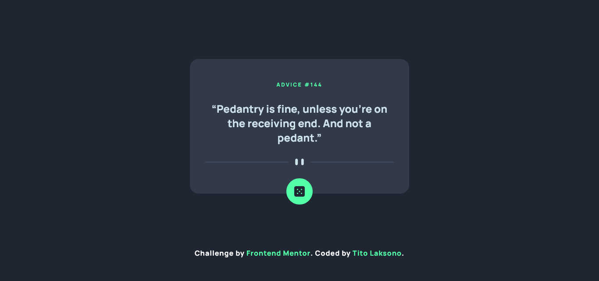

# Frontend Mentor - Advice generator app solution

This is a solution to the [Advice generator app challenge on Frontend Mentor](https://www.frontendmentor.io/challenges/advice-generator-app-QdUG-13db). Frontend Mentor challenges help you improve your coding skills by building realistic projects.

## Table of contents

- [Overview](#overview)
  - [Screenshot](#screenshot)
  - [Links](#links)
- [My process](#my-process)
  - [Built with](#built-with)
  - [What I learned](#what-i-learned)
  - [Useful resources](#useful-resources)
- [Author](#author)

## Overview

### Screenshot

### Links

- Solution URL: [Click Here](#)
- Live Site URL: [Click Here](#)

## My process

### Built with

- Semantic HTML5 markup
- CSS custom properties
- Flexbox
- Mobile-first workflow
- Javascript

### What I learned

I learn how to make an API call using cache

### Useful resources

- [CSS Media Queries](https://www.w3schools.com/css/css3_mediaqueries.asp) - This helped me to use Mobile-first workflow.

## Author

- Website - [Tito Laksono](https://www.tlaksono.my.id)
- Frontend Mentor - [@tlaksono7](https://www.frontendmentor.io/profile/tlaksono7)
- Twitter - [@_titolaksono_](https://www.twitter.com/_titolaksono)
